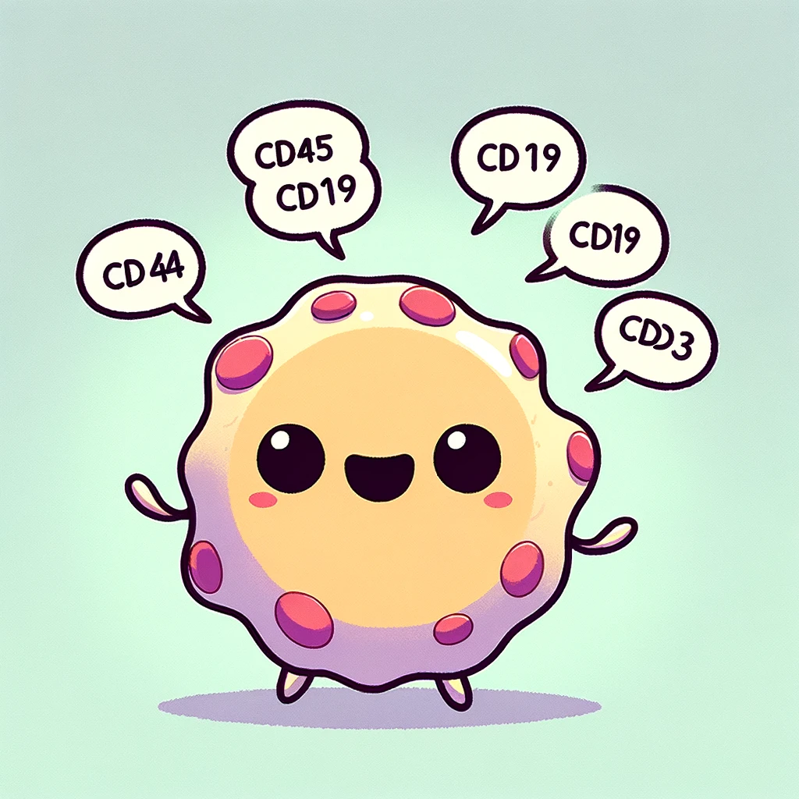

# Talk Can Cells?

Do cells have a language? With the recent success of large language models and the vast number of curated gene pathways, we visited this fundamental question one more time. We trained a decoder-only transformer model with 120M parameters on >250,000 human pathways, and then asked the model to complete 1000 unseen pathways with 80% masking in zero-shot setting. Remarkably, this simple ready-to-use model was able to complete more than half of the pathways (660/1000) with significant overlap. Our results suggest that even relatively small transformers can capture underlying connection among genes and understand the true nature of cell language.

>> [Link](https://eonurk.github.io/TCC/). 

